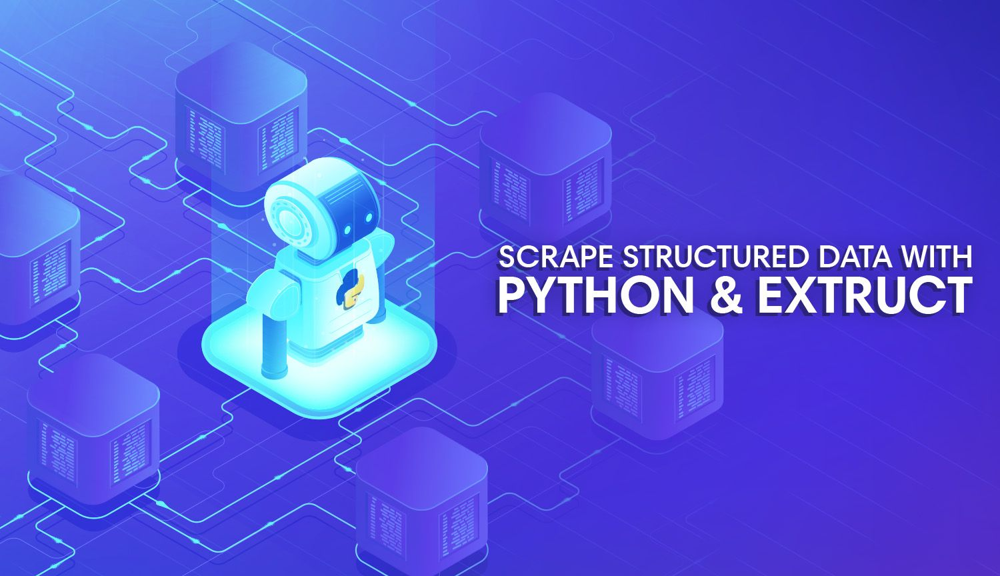

# Structured Data Scraping Tutorial


[](https://github.com/hackersandslackers/jsonld-scraper-tutorial/issues)
[](https://github.com/hackersandslackers/jsonld-scraper-tutorial/stargazers)
[](https://github.com/hackersandslackers/jsonld-scraper-tutorial/network)



Supercharge your scraper to extract quality page metadata by parsing JSON-LD data via Python's [extruct](https://github.com/scrapinghub/extruct) library.

This repository contains source code for the accompanying tutorial on Hackers and Slackers: https://hackersandslackers.com/scrape-metadata-json-ld/


## Installation

**Installation via `requirements.txt`**:

```shell
$ git clone https://github.com/hackersandslackers/jsonld-scraper-tutorial.git
$ cd jsonld-scraper-tutorial
$ python3 -m venv myenv
$ source myenv/bin/activate
$ pip3 install -r requirements.txt
$ python3 main.py
```

**Installation via [Pipenv](https://pipenv-fork.readthedocs.io/en/latest/)**:

```shell
$ git clone https://github.com/hackersandslackers/jsonld-scraper-tutorial.git
$ cd jsonld-scraper-tutorial
$ pipenv shell
$ pipenv update
$ python3 main.py
```

**Installation via [Poetry](https://python-poetry.org/)**:

```shell
$ git clone https://github.com/hackersandslackers/jsonld-scraper-tutorial.git
$ cd jsonld-scraper-tutorial
$ poetry shell
$ poetry update
$ poetry run
```

-----

**Hackers and Slackers** tutorials are free of charge. If you found this tutorial helpful, a [small donation](https://www.buymeacoffee.com/hackersslackers) would be greatly appreciated to keep us in business. All proceeds go towards coffee, and all coffee goes towards more content.
